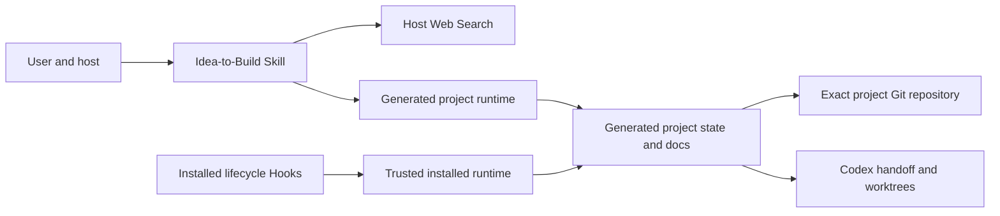

# Architecture

**English** | [简体中文](ARCHITECTURE.zh-CN.md)

## Purpose and components

Idea-to-Build is a local Plugin package, not a hosted application. The manifest exposes one Skill; the Skill provides policy/references, templates, and standard-library CLIs; lifecycle Hooks add context and integrity guardrails. There is no MCP server, database, authentication subsystem, telemetry service, or plugin-operated network endpoint.

The Hooks deliberately import the runtime shipped inside the installed plugin, never Python copied into an opened project. Project runtime copies are still used by explicit project CLI commands and must be treated as repository code.

## Workflow state and invariants

`project_state.json` stores mutable workflow progress. `requirements_ledger.json` stores user facts and decisions, but code owns the fixed 38-ID gate metadata. Neither is a security authority.

The presence and validity of a non-template `core.lock.json` is the monotonic frozen signal. The lock enumerates exactly five core files, normalized SHA-256 values, the aggregate hash, and confirmation metadata. A mutable `core_frozen` state field cannot disable verification.

Generated design files, live documents, prompts, and runtime copies remain mutable. Their content is derived guidance and can contain untrusted user/research data.

## Trust boundaries

- Host ↔ Plugin: the host decides installation, filesystem/network/tool access, Hook trust, and event delivery.
- Web Search ↔ external services: query text leaves the local project according to host policy.
- Installed Plugin ↔ opened project: the project is untrusted; Hooks load only installed code and safe repository-relative paths reject links/junctions.
- AI task ↔ human terminal: confirmation/freeze is a procedural human boundary. Hooks reduce accidental direct execution but cannot cryptographically prove who invoked a program.
- Project ↔ Git: commit/tag operations require `git rev-parse --show-toplevel` to equal the generated project root. Parent-repository operation is rejected.
- Workstream ↔ workstream: writable paths must be repository-relative, non-protected, and non-overlapping; shared integration files need an explicit owner.

## Failure behavior

Invalid JSON/schema, missing requirements, future schema versions, malformed locks, escaped paths, linked targets, parent Git roots, stale tests, conflicting research, and missing candidates fail closed. Freeze preflights Git and managed staging; failures before a successful commit restore lock/state/permissions/staging. A commit that succeeds before a tag failure is durable and reported as partial success.

## Compatibility

The runtime targets Python 3.9+ and uses no external packages. CI covers Linux, Windows, and macOS. Files are UTF-8; core hashes normalize CRLF/CR to LF without rewriting source text.