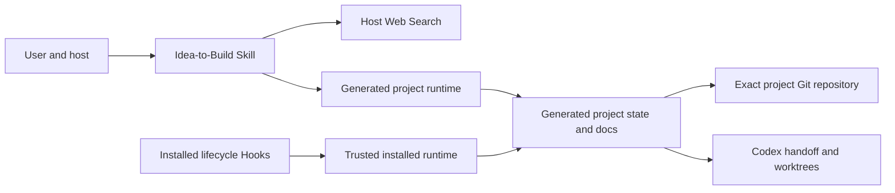

# Architecture

**English** | [简体中文](ARCHITECTURE.zh-CN.md)

## Purpose and components

Idea-to-Build is a local Plugin package, not a hosted application. The manifest exposes one Skill; the Skill provides policy/references, templates, and standard-library CLIs; lifecycle Hooks add context and integrity guardrails. There is no MCP server, database, authentication subsystem, telemetry service, or plugin-operated network endpoint.



The Hooks deliberately import the runtime shipped inside the installed plugin, never Python copied into an opened project. Project runtime copies are still used by explicit project CLI commands and must be treated as repository code.

## Workflow state and invariants

`project_state.json` stores mutable workflow progress. `requirements_ledger.json` stores user facts and decisions, but code owns the fixed 38-ID gate metadata. Neither is a security authority. `transition_state()` enforces `TRANSITIONS` for the manual transition command; research, readiness, freeze, generation, and dispatch code also assign phases directly under their own checks, so the graph is not a universal interception point.

The presence and validity of a non-template `core.lock.json` is the monotonic frozen signal. The lock enumerates exactly five core files, normalized SHA-256 values, the aggregate hash, and confirmation metadata. A mutable `core_frozen` state field cannot disable verification.

Generated design files, live documents, prompts, and runtime copies remain mutable. Their content is derived guidance and can contain untrusted user/research data.

## Conditional MCP guidance for generated products

After requirements readiness, the Skill may assess MCP for the product being designed and must record exactly one not-applicable, use-existing, build-custom, or defer recommendation. The gate requires a confirmed AI/agent client, external runtime capabilities, a compatible MCP host, and a material advantage over a direct integration. Evidence gaps defer the decision; existing maintained servers are preferred over custom implementations.

This adds guidance and `docs/design/MCP_INTEGRATION_GUIDE.md` to generated projects, not an MCP server or network client to this Plugin. Candidate instructions, tool descriptions, resource content, and server output remain untrusted. Installation, credentials, host configuration, and core freeze stay explicit user-controlled actions.

## On-demand development orchestration

Handoff generation first merges overlapping ownership. One effective workstream produces `SINGLE_AGENT` mode and a root-agent prompt only. Two or more independent workstreams produce `SUBAGENTS` mode, self-contained prompts, dependency waves, and isolated sibling worktrees.

`codex/dispatch.json` is a hashed execution manifest bound to the project ID and frozen core hash. Root-agent versus subagent execution is reversible and not part of the frozen product contract. Native execution requires a current user request to proceed after freeze, a clean exact Git root, committed prompts/manifest, and available Codex collaboration tools. The local adapter creates worktrees, validates commits, and performs conflict-aborting verified merges; it does not provide or emulate the host's subagent API.

## Trust boundaries

- Host ↔ Plugin: the host decides installation, filesystem/network/tool access, Hook trust, and event delivery.
- Web Search ↔ external services: query text leaves the local project according to host policy.
- Installed Plugin ↔ opened project: the project is untrusted; Hooks load only installed code and safe repository-relative paths reject links/junctions.
- AI task ↔ human terminal: confirmation/freeze is a procedural human boundary. Hooks reduce accidental direct execution but cannot cryptographically prove who invoked a program.
- Project ↔ Git: commit/tag operations require `git rev-parse --show-toplevel` to equal the generated project root. Parent-repository operation is rejected.
- Workstream ↔ workstream: writable paths must be repository-relative, non-protected, and non-overlapping; shared integration files need an explicit owner.

## Failure behavior

Syntactically invalid JSON, future schema versions, protected requirement metadata drift, malformed core locks, escaped/linked paths, parent Git roots, stale test snapshots, conflicting research, and empty candidate arrays are rejected on the paths that explicitly validate them. Validation is not a complete JSON Schema: several state fields and required research-evidence fields receive only shallow or no validation. Freeze preflights Git and managed staging; failures before a successful commit restore lock/state/permissions/staging. A commit that succeeds before a tag failure is durable and reported as partial success.

## Compatibility

The runtime targets Python 3.9+ and uses no external packages. CI is configured for Linux, Windows, and macOS. Files are UTF-8; core hashes normalize CRLF/CR to LF without rewriting source text.

## Repository and runtime layers

| Layer | Responsibility | Primary evidence |
| --- | --- | --- |
| Package discovery | Declares the Plugin, Skill path, marketplace source, and Hook events | `.codex-plugin/plugin.json`, `.agents/plugins/marketplace.json`, `hooks/hooks.json` |
| Host guidance | Defines activation boundaries, research discipline, human freeze, and Codex orchestration | `skills/idea-to-build/SKILL.md`, `skills/idea-to-build/references/` |
| Trusted Hook boundary | Reads host event JSON, finds generated projects, loads only installed runtime code, injects context, and blocks/detects protected mutations | `hooks/_hooklib.py`, five Hook entrypoints |
| Authoritative source runtime | Implements state/schema, research, readiness, hashing, generation, Git, and dispatch behavior | `skills/idea-to-build/scripts/idea_to_build_lib.py` and thin CLI wrappers |
| Generated project | Stores project-specific state/contracts/design/live documents, prompts, and a copied CLI runtime | `skills/idea-to-build/assets/project-template/` |
| Verification fixtures | Exercise generated-project behavior and a synthetic frozen baseline | `tests/`, `examples/team-brief-generator/` |

The Python wrappers depend inward on `idea_to_build_lib.py`; the core library does not import the wrappers or Hooks. Hooks share `_hooklib.py`, which imports the installed core library dynamically. Generated project copies are invoked only by explicit project CLI commands. No frontend, backend, database, queue, cache, scheduler, or daemon exists.

## Startup and principal data flow

Installation makes the manifest, Skill, and Hooks available to Codex. On a matching user request, the Skill guides host Web Search and explicit project CLIs. On Hook events, the host starts the relevant small Python entrypoint and passes one JSON event on stdin. A generated project produces one JSON decision/context payload on stdout; a non-project path normally produces no output. The entrypoint locates a generated project by `.idea-to-build/project_state.json`, then uses the installed trusted runtime to verify and render context.

```mermaid
sequenceDiagram
  participant U as User
  participant C as Codex host
  participant H as Lifecycle Hook
  participant S as Skill
  participant R as Project CLI runtime
  participant F as Files and Git
  U->>C: Product idea or development request
  C->>H: Event JSON
  H->>F: Locate state and verify frozen core
  H-->>C: Context or deny/block decision
  C->>S: Activate guided workflow
  S->>C: Request minimized live research when required
  C->>R: Run explicit state/research/readiness/generation command
  R->>F: Atomically replace JSON; directly write Markdown; run Git steps
  F-->>R: State, hashes, commits, branches, and diffs
  R-->>C: Structured JSON result
```

After freeze, `generate_handoff()` derives workstreams and produces a hash-bound dispatch manifest. In `SINGLE_AGENT` mode the root task works in the integration tree. In `SUBAGENTS` mode the host protocol is responsible for spawning only the current dependency wave; the adapter creates sibling worktrees and later verifies branch tip, ancestry, non-empty owned diff, and core integrity. The adapter does not persist completed tasks or enforce wave/merge order by itself.

## Errors, identity, and background processing

Expected validation/workflow failures use `IdeaToBuildError`; CLI wrappers generally emit structured error JSON and a non-zero exit status. `record-test` lets the child test process write to the terminal before the final JSON, and `render_context --format text` is intentionally plain text. JSON writes use a same-directory temporary file plus `os.replace`; Markdown writes are direct. Freeze and dispatch start have scoped rollback, while a commit that became durable before a later failure is preserved and reported rather than erased.

There is no application authentication or authorization subsystem. The human-freeze boundary is procedural (`actor: human`, an exact confirmation, and AI Hook denial), not cryptographic identity proof. Filesystem/Git/Codex permissions are inherited from the user and host.

There are no background workers, queues, caches, or scheduled jobs. All Python work is synchronous. Hook-level timeouts are configured by `hooks/hooks.json`; ordinary Git subprocesses currently have no explicit timeout.

## Important implementation limits

- State, core lock, dispatch manifest, prompts, and Git HEAD form a multi-file consistency boundary rather than one transaction; initialization and handoff generation can leave partial output on late failures.
- Specialized commands can assign workflow phases without calling `transition_state()`; the declared transition graph is not a universal gate.
- Dependency waves and merge order are generated guidance enforced by the host workflow, not persisted completion state in the adapter.
- `last_test.json` is mutable repository data. The recorder now binds project ID, a runner marker, the still-declared command, exit status, and the current Git snapshot; PreToolUse blocks direct Hook-visible writes and Stop validates those fields. This reduces accidental/agent-tool forgery but is not cryptographic attestation against external processes with filesystem access.
- Generated projects retain runtime snapshots; installed Hooks may use a newer trusted runtime, so compatibility and upgrade policy matter.
- Lifecycle Hooks observe only events delivered by the host and cannot police external editors/processes.
- Native Codex host execution is not exercised by CI; Python tests validate the adapter contract and Git behavior.
- The current source has no automatic dispatch-finalization transition to `COMPLETE`.

## Repository-memory architecture (0.4)

After core freeze, the runtime adds four coordinated layers: protected rules/core, per-task SPEC/PLAN, canonical `.idea-to-build/tasks.json`, and configured quality gates with snapshot-bound evidence. `docs/live/TASKS.md` is generated from JSON and never becomes a second state source. `render_context()` selects one task and emits bounded, data-delimited summaries; parallel mode refuses to guess. Stop uses a lightweight path for memory-only maintenance and a task-aware path for substantive changes.

`guided_sequential` plans one root task without mandatory worktrees. `parallel_worktrees` derives child work only from canonical ready tasks, dependency waves, and non-overlapping ownership. Handoff and dispatch bind each child to task ID, SPEC, PLAN, quality gates, prompt hash, branch, worktree, and owned paths.

Older project-local runtimes remain readable. The additive migrator never overwrites them; when they lack 0.4 APIs it adds a versioned compatibility runtime used only by new memory CLIs. Installed Hooks continue to import only the installed Plugin runtime.
