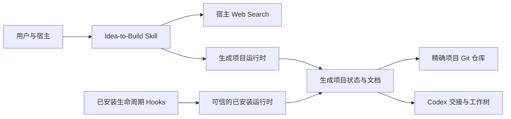
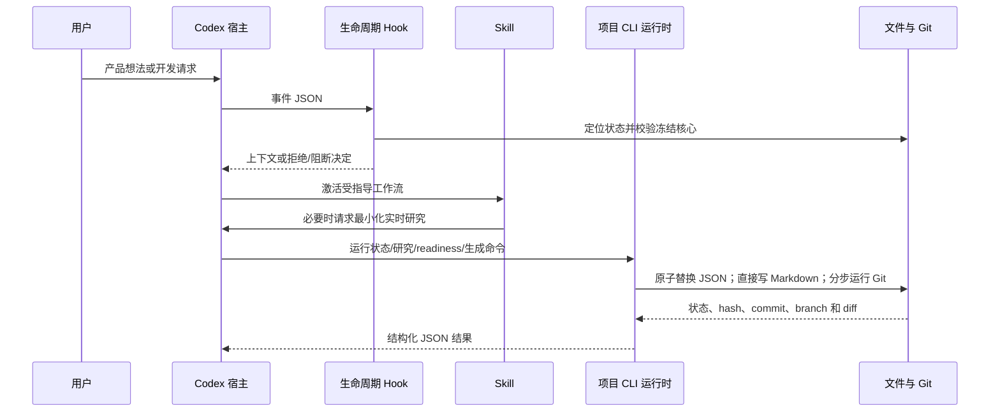

# 架构

[English](ARCHITECTURE.md) | **简体中文**

## 定位与组件

Idea-to-Build 是本地 Plugin 包，不是托管应用。manifest 暴露一个 Skill；Skill 提供策略/参考、模板和标准库 CLI；生命周期 Hooks 增加上下文与完整性保护。项目没有 MCP server、数据库、认证、遥测或插件自营网络端点。

Hooks 只导入已安装插件中的运行时，绝不导入打开项目内复制的 Python。项目侧运行时仍由显式 CLI 使用，必须按仓库代码审查。

## 状态与不变量

`project_state.json` 保存可变流程进度；`requirements_ledger.json` 保存用户事实与决定，但固定 38 项 ID 和门禁元数据由代码定义。这两者都不是安全事实来源。`transition_state()` 只为手工 transition 命令执行 `TRANSITIONS`；研究、readiness、冻结、生成和调度代码还会在各自检查下直接写阶段，因此该图不是所有阶段写入的统一拦截点。

非模板 `core.lock.json` 的存在与有效性是单调冻结信号。锁必须精确列出五个核心文件、规范化 SHA-256、聚合 hash 与确认元数据；修改可变的 `core_frozen` 字段不能关闭校验。

设计文档、live 文档、提示词和运行时副本保持可变，其中的用户/研究输入应按不可信数据处理。

## 生成产品的条件式 MCP 指导

需求 readiness 通过后，Skill 才可评估用户产品是否需要 MCP，并且必须在“不适用、使用现有、自建、延后”中记录一个结论。门槛要求已确认的 AI/agent 客户端、运行时外部能力、兼容的 MCP 宿主，以及相对直接集成的实质优势；证据不足时延后，能满足需求时优先采用已维护的现有 server。

本功能只为生成项目增加指导和 `docs/design/MCP_INTEGRATION_GUIDE.md`，不会给本 Plugin 增加 MCP server 或网络客户端。候选安装说明、工具描述、资源内容和 server 输出仍是不可信输入；安装、凭据、宿主配置和核心冻结仍由用户显式控制。

## 按需开发编排

生成交接前会先合并所有权重叠的工作流。只有一个有效工作流时使用 `SINGLE_AGENT`，只生成根智能体提示词；存在两个以上独立工作流时使用 `SUBAGENTS`，生成独立提示词、依赖波次和隔离的同级 Git 工作树。

`codex/dispatch.json` 是绑定项目 ID 与冻结核心 hash 的执行清单。根智能体或子智能体属于可逆执行策略，不写入冻结产品契约。原生执行要求用户在冻结后于当前任务中要求继续开发、精确且干净的 Git 根、已提交的提示词/清单，以及宿主实际提供 Codex 协作工具。本地适配器负责工作树、提交验证和遇到冲突即中止的受控合并，不提供也不模拟宿主的子智能体 API。

## 信任边界

- 宿主 ↔ Plugin：宿主决定安装、文件/网络/工具权限、Hook 信任和事件投递。
- Web Search ↔ 外部服务：查询文字按宿主策略离开本地项目。
- 已安装 Plugin ↔ 打开项目：项目不可信；Hooks 只加载已安装代码，安全路径拒绝链接/junction。
- AI 任务 ↔ 人类终端：确认/冻结是流程上的人类边界；Hooks 不能以密码学方式证明调用者身份。
- 项目 ↔ Git：只有 `git rev-parse --show-toplevel` 等于项目根时才允许 commit/tag，拒绝父仓库。
- 工作流 ↔ 工作流：写入路径必须是仓库内、非保护且互不重叠；共享集成文件必须有明确 owner。

## 失败行为

语法无效的 JSON、未来 schema、受保护需求元数据漂移、损坏核心锁、越界/链接路径、父 Git 根、过期测试快照、冲突研究和空候选，会在显式校验这些条件的路径上被拒绝。当前没有完整 JSON Schema：若干 state 字段和协议要求的研究证据字段只有浅层校验或未校验。冻结先预检 Git/暂存区；commit 成功前的失败会恢复锁、状态、权限和受管暂存。commit 成功但 tag 失败属于持久的部分成功，会明确报告。

## 兼容性

运行时目标为 Python 3.9+，无外部包。CI 配置覆盖 Linux、Windows、macOS。文件使用 UTF-8；核心 hash 将 CRLF/CR 规范为 LF，但不改写源文件。

## 仓库与运行时分层

| 层 | 职责 | 主要证据 |
| --- | --- | --- |
| 包发现 | 声明 Plugin、Skill 路径、marketplace 来源和 Hook 事件 | `.codex-plugin/plugin.json`、`.agents/plugins/marketplace.json`、`hooks/hooks.json` |
| 宿主指导 | 定义激活边界、研究纪律、人类冻结和 Codex 编排 | `skills/idea-to-build/SKILL.md`、`skills/idea-to-build/references/` |
| 可信 Hook 边界 | 读取宿主事件 JSON、定位生成项目、仅加载已安装运行时、注入上下文并阻止/检测受保护变更 | `hooks/_hooklib.py`、五个 Hook 入口 |
| 权威源码运行时 | 实现状态/schema、研究、readiness、hash、生成、Git 和 dispatch 行为 | `skills/idea-to-build/scripts/idea_to_build_lib.py` 及薄 CLI 包装器 |
| 生成项目 | 保存项目状态、契约、设计/live 文档、提示词和复制的 CLI 运行时 | `skills/idea-to-build/assets/project-template/` |
| 验证夹具 | 覆盖生成项目行为和完全合成的冻结基线 | `tests/`、`examples/team-brief-generator/` |

Python CLI 包装器向内依赖 `idea_to_build_lib.py`；核心库不反向导入包装器或 Hook。Hook 共享 `_hooklib.py`，由它动态导入已安装插件的核心库。生成项目中的副本只由显式项目 CLI 调用。仓库没有前端、后端、数据库、队列、缓存、定时任务或守护进程。

## 启动过程与主要数据流

安装让 Codex 发现 manifest、Skill 和 Hooks。匹配用户请求时，Skill 指导宿主 Web Search 和显式项目 CLI。发生 Hook 事件时，宿主启动相应小型 Python 入口，通过 stdin 传入单个 JSON 事件。生成项目会在 stdout 返回一个 JSON 决策/上下文；非项目路径通常不输出内容。入口通过 `.idea-to-build/project_state.json` 定位生成项目，再使用已安装的可信运行时校验并渲染上下文。

冻结后，`generate_handoff()` 从工作流生成 hash 绑定的 dispatch manifest。`SINGLE_AGENT` 模式由根任务在集成树工作；`SUBAGENTS` 模式由宿主协议负责只启动当前依赖波次，adapter 创建同级 worktree，并校验分支 tip、祖先关系、非空 owned diff 和核心完整性。adapter 自身不持久化已完成任务，也不强制 wave/merge order。

## 错误、身份与后台处理

预期校验/工作流失败使用 `IdeaToBuildError`；CLI 包装器通常输出结构化错误 JSON 和非零退出码。`record-test` 的子测试进程会先直接输出终端内容，`render_context --format text` 则有意输出纯文本。JSON 写入使用同目录临时文件加 `os.replace`；Markdown 直接写入。冻结和 dispatch 启动提供限定范围回滚；若 commit 已经持久化后才发生后续失败，则保留并报告，而不是擦除历史。

仓库没有应用认证/授权子系统。人类冻结边界是流程性约束（`actor: human`、精确确认文本和 AI Hook deny），不是密码学身份验证。文件系统、Git 和 Codex 权限继承用户与宿主。

没有后台 worker、队列、缓存或定时任务；Python 工作均为同步执行。Hook 超时由 `hooks/hooks.json` 配置；普通 Git 子进程目前没有显式 timeout。

## 重要实现限制

- state、core lock、dispatch manifest、prompts 与 Git HEAD 构成多文件一致性边界，不是单一事务；初始化和 handoff 生成在后期失败时可能留下部分输出。
- 专项命令可以不调用 `transition_state()` 而直接写阶段；声明的转换图不是统一门禁。
- 依赖波次与 merge order 是由宿主工作流执行的生成指导，不是 adapter 持久化的完成状态。
- `last_test.json` 是可变仓库数据；recorder 绑定项目 ID、runner 标记、仍在 state 中声明的命令、退出状态和当前 Git 快照，PreToolUse 阻止 Hook 可观察的直接写入，Stop 校验这些字段。这能降低误写和智能体工具伪造风险，但不能对有文件系统权限的外部进程提供密码学证明。
- 生成项目保留运行时快照；已安装 Hook 可能使用更高版本可信运行时，因此兼容与升级策略很重要。
- 生命周期 Hook 只能观察宿主实际发送的事件，不能管控外部编辑器/进程。
- CI 不执行真实 Codex 宿主流程；Python 测试验证 adapter 契约和 Git 行为。
- 当前源码没有把 dispatch 自动收尾到 `COMPLETE` 的转换。
