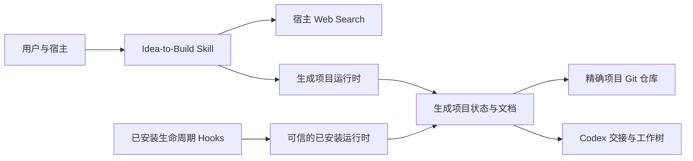

# 架构

[English](ARCHITECTURE.md) | **简体中文**

## 定位与组件

Idea-to-Build 是本地 Plugin 包，不是托管应用。manifest 暴露一个 Skill；Skill 提供策略/参考、模板和标准库 CLI；生命周期 Hooks 增加上下文与完整性保护。项目没有 MCP server、数据库、认证、遥测或插件自营网络端点。

Hooks 只导入已安装插件中的运行时，绝不导入打开项目内复制的 Python。项目侧运行时仍由显式 CLI 使用，必须按仓库代码审查。

## 状态与不变量

`project_state.json` 保存可变流程进度；`requirements_ledger.json` 保存用户事实与决定，但固定 38 项 ID 和门禁元数据由代码定义。这两者都不是安全事实来源。

非模板 `core.lock.json` 的存在与有效性是单调冻结信号。锁必须精确列出五个核心文件、规范化 SHA-256、聚合 hash 与确认元数据；修改可变的 `core_frozen` 字段不能关闭校验。

设计文档、live 文档、提示词和运行时副本保持可变，其中的用户/研究输入应按不可信数据处理。

## 按需开发编排

生成交接前会先合并所有权重叠的工作流。只有一个有效工作流时使用 `SINGLE_AGENT`，只生成根智能体提示词；存在两个以上独立工作流时使用 `SUBAGENTS`，生成独立提示词、依赖波次和隔离的同级 Git 工作树。

`codex/dispatch.json` 是绑定项目 ID 与冻结核心 hash 的执行清单。根智能体或子智能体属于可逆执行策略，不写入冻结产品契约。原生执行要求用户在冻结后于当前任务中要求继续开发、精确且干净的 Git 根、已提交的提示词/清单，以及宿主实际提供 Codex 协作工具。本地适配器负责工作树、提交验证和遇到冲突即中止的受控合并，不提供也不模拟宿主的子智能体 API。

## 信任边界

- 宿主 ↔ Plugin：宿主决定安装、文件/网络/工具权限、Hook 信任和事件投递。
- Web Search ↔ 外部服务：查询文字按宿主策略离开本地项目。
- 已安装 Plugin ↔ 打开项目：项目不可信；Hooks 只加载已安装代码，安全路径拒绝链接/junction。
- AI 任务 ↔ 人类终端：确认/冻结是流程上的人类边界；Hooks 不能以密码学方式证明调用者身份。
- 项目 ↔ Git：只有 `git rev-parse --show-toplevel` 等于项目根时才允许 commit/tag，拒绝父仓库。
- 工作流 ↔ 工作流：写入路径必须是仓库内、非保护且互不重叠；共享集成文件必须有明确 owner。

## 失败行为

无效 JSON/schema、缺失需求、未来 schema、损坏锁、越界/链接路径、父 Git 根、过期测试、冲突研究和空候选均 fail closed。冻结先预检 Git/暂存区；commit 成功前的失败会恢复锁、状态、权限和受管暂存。commit 成功但 tag 失败属于持久的部分成功，会明确报告。

## 兼容性

运行时目标为 Python 3.9+，无外部包。CI 覆盖 Linux、Windows、macOS。文件使用 UTF-8；核心 hash 将 CRLF/CR 规范为 LF，但不改写源文件。