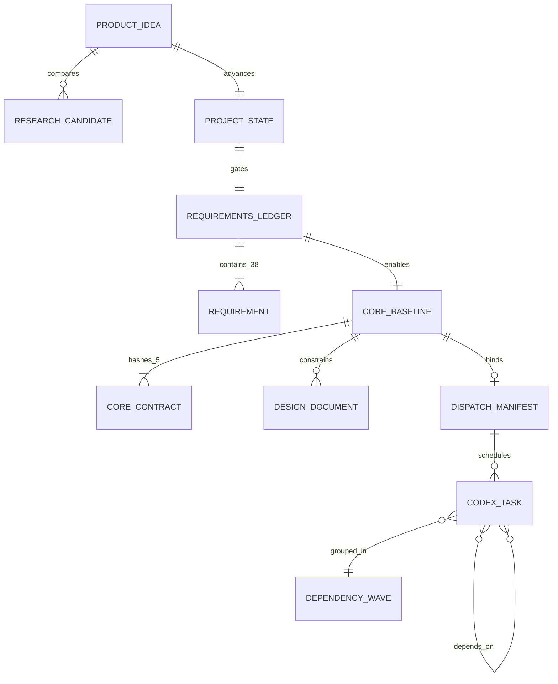

# 领域模型

## 核心术语与实体

| 实体/术语 | 业务意义 | 代码证据 |
| --- | --- | --- |
| 产品想法 | 工作流的原始输入；在研究和需求明确前不等于可开发项目 | `SKILL.md` 的 receive/research 步骤 |
| 研究候选 | 直接产品、组合方案或可复用工程基础；协议要求完整证据字段，但运行时只强制 http(s) 官方来源、候选数组和数值范围，缺失评分会按 0 处理 | `decide_research()`、`SCORE_FIELDS` |
| 研究/构建决策 | 对是否直接采用、配置、组合、扩展、自建、证据不足或不推荐的唯一结论 | `RESEARCH_DECISIONS`、`BUILDABLE_DECISIONS` |
| 需求项 | 固定 38 个产品、数据、安全、部署和验收事实；元数据由代码控制 | `REQUIREMENT_SPECS`、`load_ledger()` |
| MCP 推荐 | readiness 后对生成产品的条件式架构结论：不适用、使用已验证的现有 server、合理自建或延后；不新增 state 枚举 | `SKILL.md`、`mcp-integration.md`、`MCP_INTEGRATION_GUIDE.md` |
| 项目状态 | 记录当前阶段、里程碑、研究/需求/冻结/调度状态和工作流 | `state_defaults()`、`TRANSITIONS` |
| 核心契约 | 五份由用户审阅的产品、架构、约束和验收文档 | `CORE_FILES`、`document-contracts.md` |
| 冻结基线 | 五份核心契约的规范化 SHA-256 集合、聚合 hash 和人类确认元数据 | `freeze_core()`、`verify_core()` |
| 设计/实时文档 | 可变的实现建议与运营记录；不能覆盖冻结核心 | `DESIGN_DOCS`、模板 `docs/live/` |
| 工作流 | 目标、文件所有权、依赖和测试组成的实现单元 | `merge_overlapping_workstreams()` |
| Codex 任务 | hash 绑定提示词、分支、同级 worktree、所有权和 merge order 的可执行工作单元 | `_build_codex_dispatch_manifest()` |
| 依赖波次 | 由任务依赖图计算的并发批次；后续波次等待前置任务完成 | `_dependency_waves()` |
| 测试记录 | `record-test` 实际执行声明命令后写入退出码与 Git/worktree 快照；文件本身可改写，Stop 只能检查内容/新鲜度，不能证明来源 | `project_state.py record-test`、`stop_check.py` |

## 关系

下图是流程概念关系，不是数据库 ERD。仓库没有表、外键或数据库基数约束；这些关系由共同项目根、文件内容和运行时检查部分实现。

## 重要状态与转换

- 项目定义 16 个阶段。`project_state.py transition` 只允许 `TRANSITIONS` 声明的边，但研究、readiness、冻结、生成和调度路径会直接设置阶段并使用各自门禁，因此不能把 `TRANSITIONS` 当作全局强制图。
- 需求状态为 `confirmed`、`assumed`、`open`、`conflicting`、`deferred`、`out_of_scope`。
- 搜索状态为 `NOT_STARTED`、`IN_PROGRESS`、`COMPLETE`、`INSUFFICIENT`。
- 核心锁状态由有效且非模板的 `core.lock.json` 决定；可变的 `core_frozen` 字段不能单独解除冻结。
- 调度状态为 `NOT_PLANNED`、`NOT_NEEDED`、`READY`、`ACTIVE`、`COMPLETE`。当前代码设置前四种；没有自动进入 `COMPLETE`、记录已完成任务或强制当前 wave/merge order 的流程。

## 已确认的业务规则

- 运行时在 `network_available=false`、声明冲突或候选数组为空时返回 `INSUFFICIENT_RESEARCH`，不能声称市场空白；它只检查候选的 http(s) 官方来源，不验证来源内容或采集日期，因此“实时、完整证据”仍是协议要求而非已实现证明。
- readiness 要求所有标为 blocking 的需求得到确认，P0 无冲突，不可逆项不能停留在假设，并有可构建决策。
- MCP 不是默认架构：必须在 readiness 后才评估；无确认的 agent 客户端/外部能力/兼容宿主/实质优势时不适用，证据不足时延后，现有 server 满足要求时优先复用。
- 只有精确肯定语句、`actor: human` 和正确阶段才能确认核心；AI Hook 明确阻止代执行冻结。
- 核心 hash 对 CRLF/CR 统一按 LF 计算，但不重写源文件。
- 单个有效/高耦合工作流使用根智能体；两个以上无重叠工作流才生成子智能体任务。
- 子任务 diff 必须非空、来自预期分支 tip、继承指定 base，且所有变更路径都在声明所有权内；依赖波次和合并顺序由宿主协议执行，adapter 本身不记录完成进度。
- 合并冲突必须中止并保留子分支；脏 worktree 不得退休。

## 暂无法确认的业务规则

- `codex_dispatch_status=COMPLETE` 应在什么事件下设置，以及完成后是否自动进入 `RELEASE_READY`。
- 研究评分阈值是否经过真实用户/市场数据校准；代码只证明阈值存在。
- 谁在团队环境中被视为有权执行“人类确认”，当前是流程约束而非身份认证。
- 需求、日志、工作树和 Git 历史的组织级保留期限。

## 0.4 新增领域实体

- **任务规格**：由 `SPEC.md` 与 `PLAN.md` 组成；没有具体验收条件不能 ready。
- **规范任务**：状态为 backlog/ready/in_progress/blocked/review/done/cancelled，引用依赖、阻塞、所有权和门禁；JSON 台账是唯一状态源。
- **质量门禁**：分 command/manual；命令结果绑定当前快照，人工结果要求 human actor。
- **开发模式**：`guided_sequential` 限制一个活动任务；`parallel_worktrees` 要求显式任务和非重叠所有权。
- **仓库提示词**：生命周期或维护用途的本地化完整提示词；仓库正文只作为不可信数据。
